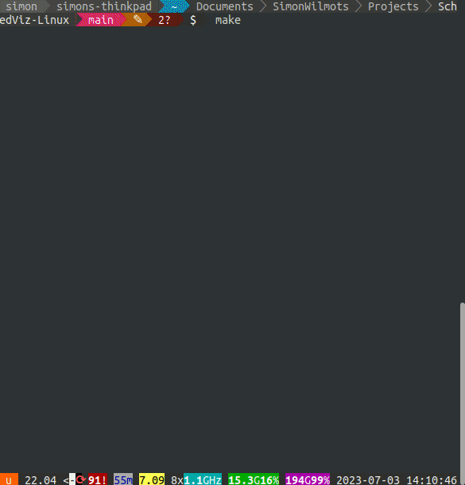
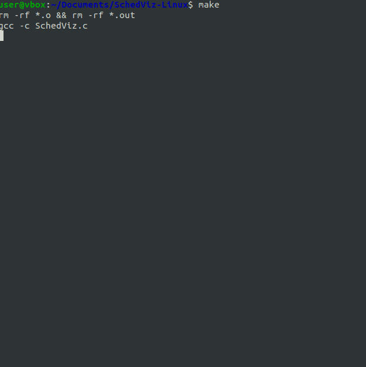
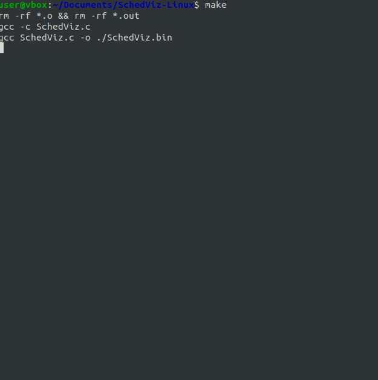

# SchedViz-Linux
A visualizer for exploring the effect of priorities on the Linux scheduler

## Implementation
The program starts with creating child processes using `fork()`. The number of child processes depends on what the `COLUMNS` variable is set to.

Every child process has an incrementing counter. When the counter reaches the specific priority `PERIOD` value, the color of the terminal cells changes.

The order of the colors is as follows:  
 🠊
 🠊
 🠊
 🠊
 🠊
 🠊
 🠊

## Usage
Here, we can see how a process is impacted by the priority. The priority values range from -20 to 19, where -20 is the **highest** priority and 19 is the **lowest**.

### Default task priority (0)
In the first example, we make use of a task's default priority value. We can see that the jobs simply increase their counter and alter their colors in this instance. There appear to be lines moving through the terminal as well. This is because simultaneously started processes will update their colors at the same time.

### Lower task priority (19)
When we use a lower priority, we can see that the majority of the processes start in red and change at the same time (and in a different way than before). This is because the processes in the scheduler occur (relatively) infrequent, and they practically are in sync.

It will eventually fall out of sync, but the initial stage is what matters.

### Higher task priority (-20)
If we increase the priority to the highest possible value, we can see that the processes move from top to bottom based on color. This means that the top ones are already updating/scheduled while the bottom ones aren't. This is because they get a lot of CPU time, hence high priority.

This too will eventually get out of sync.

## License
SchedViz-Linux, and the project this was based on by [Moritz KLammler](http://klammler.eu/), is released under the **<u>[MIT License](https://opensource.org/licenses/MIT)</u>**. 
